### Jawaban Bagian A

#### 1. Analisis Kondisi
thisneptunegirl@gmail.com

#### 2. Source Control Management
a. Menurut [Git (n.d.)](https://git-scm.com/docs/git#_git_commands), berikut ini 4 _commands_ dalam Git.  
 * **branch**: digunakan untuk menge-_list_, membuat, dan menghapus _branch_ 'cabang' dari sebuah repositori.   
  Contoh penggunaan: Menghapus _branch_ dengan nama "nama_branch". 

```shell
  git branch -d nama_branch
  ```  
 * **add**: digunakan untuk menambahkan konten dari fail ke dalam indeks. Indeks atau disebut juga _staging area_ merupakan tempat yang digunakan untuk mempersiapkan konten yang akan di-_commit_ berikutnya.  
  Contoh penggunaan: Menambahkan (_add_) konten yang diubah dari file nama_file_dan_jalurnya.
```shell
  git add nama_file_dan_jalurnya
  ```  
 * **commit**: digunakan untuk me-_record_ segala perubahan yang telah ditambahkan sebelumnya (menggunakan git-add).  
  Contoh penggunaan: Mencatat (_record_) seluruh (ditandai dengan .) perubahan konten.
```shell
  git commit .
  ```
 * **switch**: digunakan untuk mengubah _current branch_ 'cabang yang sedang ditempati'.  
  Contoh penggunaan: Mengubah _current branch_ dari _branch_ lain menjadi _branch_ dengan nama nama_branch
```shell
  git switch nama_branch
  ```

b. Tangkapan layar _source code_ Visual Studio Code
 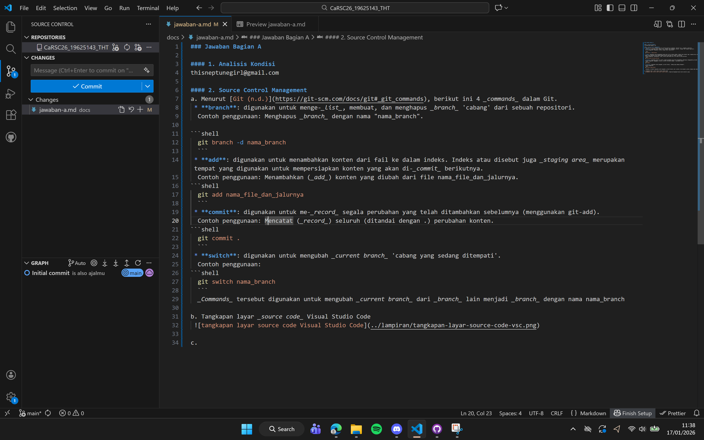

c. Tangkapan layar learn git branching
 
 
 
 

d. Tangkapan layar bukti menyelesaikan _exercise_ Git SSH Security
 

e. Tangkapan layar _history branch_:


#### 3. Pengenalan Ground Control System
a. Tangkapan layar halaman utama Mission Planner
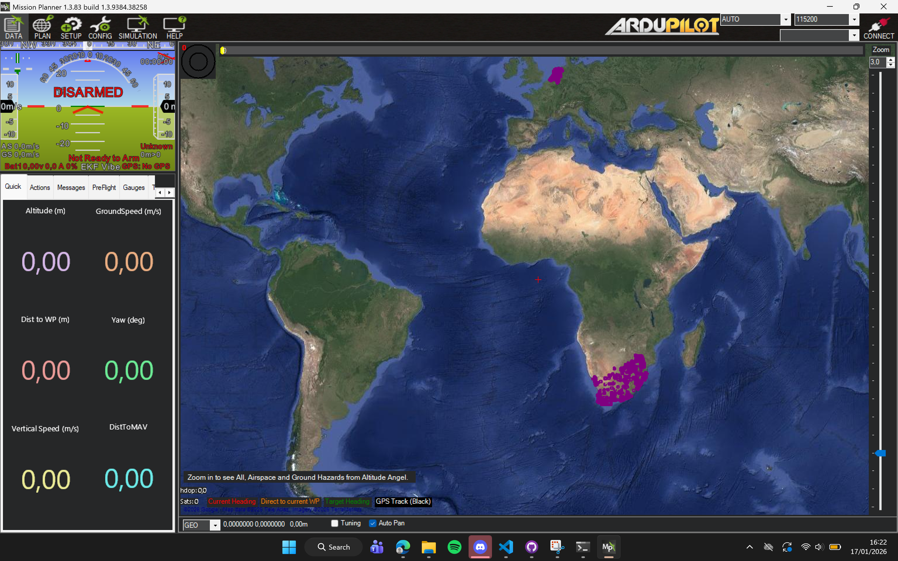

b. Merujuk pada dokumentasi [Ardupilot (2024)](https://ardupilot.org/planner/docs/mission-planner-features.html), berikut adalah fitur-fitur utama Mission Planner beserta kegunaannya dalam operasi UAV.
 * **Data**: Memberikan informasi terkait hal-hal yang dapat dilihat dan dilakukan pada Flight Data Screens. Dalam Flight Data Screen, terdapat HUD (Heads Up Area) yang berisi informasi terkait kecepatan udara, arah yang sedang dituju, seberapa jauh kesalahan arah pesawat, koneksi telemetri, sudut pembelokan, dan lainnya. Selain itu, terdapat pula Control dan Status yang memberikan informasi (seperti Status) atau kontrol terhadap kendaraan yang digunakan--dalam hal ini UAV (seperti Action). Ada pula Map Area yang memberikan visualisasi pergerakan UAV.
 * **Plan**: Dalam seksi ini, pengguna dapat merencanakan dan mengeksekusi rencana penerbangan. Rencana ini disebut dengan _Mission_ 'misi'. Di sini, terdapat Mission Planning yang dapat meng-_auto-generate_ survei dan misi berbasis grid. Kebanyakan survei dan misi didasarkan pada poligon yang digambar pada peta. Pengguna dapat menggambar poligon untuk membuat area penerbangan. Area penerbangan ini membuat batas selama penerbangan UAV berlangsung.
 * **Setup**: _Section_ ini memperbolehkan pengguna mempersiapkan dan mengonfigurasi autopilot untuk kendaraan spesifik. Kebanyakan _subsections_ memberikan informasi terkait hal-hal yang perlu dilakukan sebelum penerbangan pertama. Di sini, terdapat instalasi Firmware, perangkat keras yang diperlukan, perangkat keras yang opsional, dan tahapan yang harus dilakukan sebelum menerbangkan UAV.
 * **Simulation**: Simulation menyediakan simulasi SITL (Software in the Loop) yang memperbolehkan pengguna menjalankan UAV tanpa perangkat keras. Dalam _section_ ini, pengguna dapat melihat bagaimana UAV akan diterbangkan sebelum penerbangan dilakukan sehingga meminimalisasi kerusakan riil fisik UAV.

 c. Misi pemetaan sederhana persegi panjang 80x100  
  [misi-pemetaan-sederhana-80x100-revisi.waypoints](../lampiran/misi-pemetaan-sederhana-80x100-revisi.waypoints)
  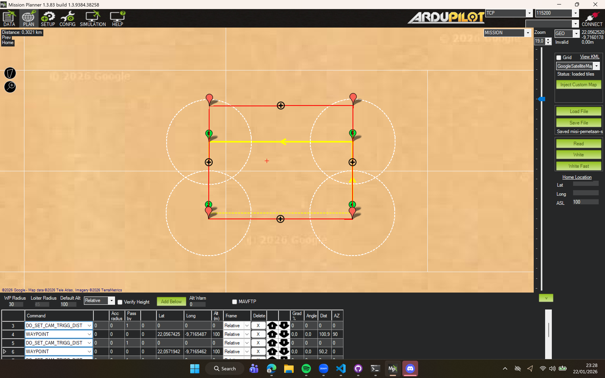


  jawaban di bawah merupakan jawaban awal, hasil revisi adalah jawaban atas.
  [misi-pemetaan-sederhana-80x100.waypoints](../lampiran/misi-pemetaan-sederhana-80x100.waypoints)
  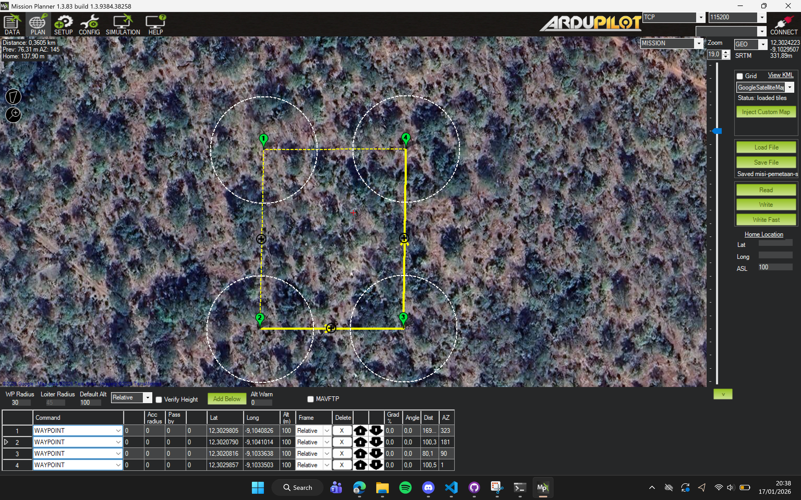


#### 4. Development Environment
Tangkapan Layar _Dualboot_ Ubuntu


a. Instalasi <code>python3</code>, <code>python3-pip</code>, <code>python3-venv</code>, <code>uvicorn</code>, dan <code>build-essential</code>.


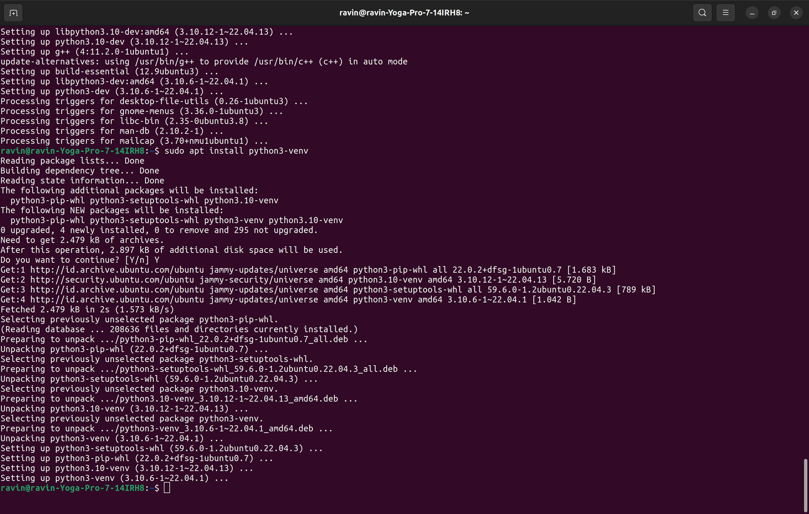
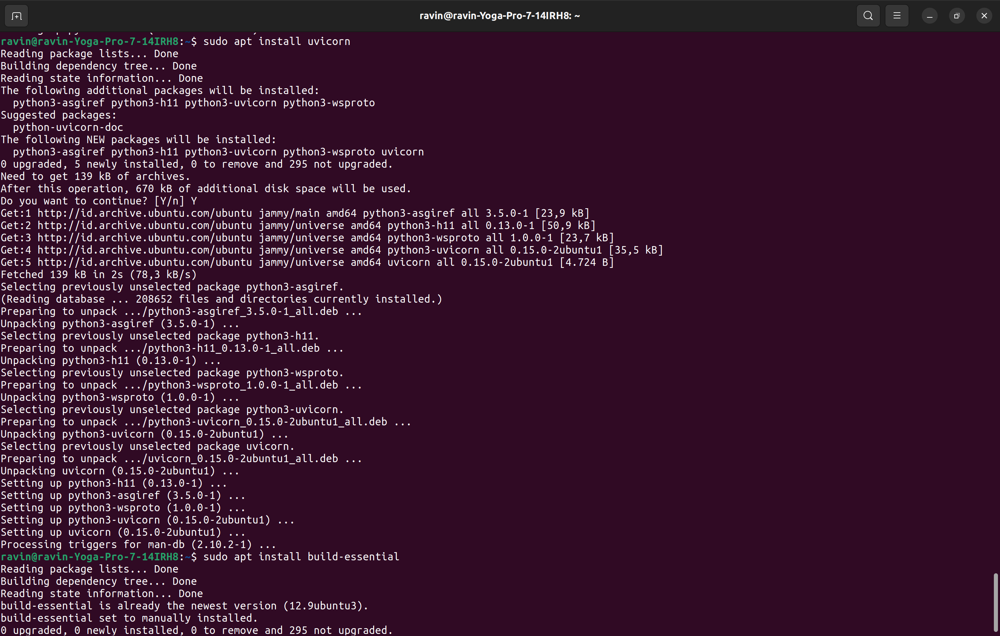

b. Sistem Talker-Listener Sederhana
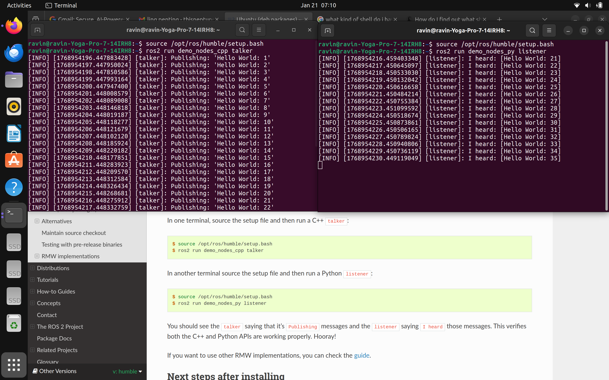

#### 5. Dasar-Dasar UAV
a. [Menurut P S dan Jeyan (2022)](https://www.researchgate.net/publication/359081357_Comparative_Analysis_of_Fixed-Wing_Rotary-Wing_and_Hybrid_Mini_Unmanned_Aircraft_Systems_UAS_from_the_Applications_Perspective), berikut ini perbedaan tiga klasifikasi UAV berdasarkan cara terbang.
 * **_Fixed-Wing_ (HTOL).** _Fixed-Wing UAV_ memiliki daya tahan penerbangan yang sangat baik sehingga dapat meliputi area yang luas dalam sekali operasi penerbangan. Beberapa keunggulan _Fixed-Wing UAV_ atau HTOL adalah desain yang sederhana, kapabilitas muatan yang lebih besar, dan kebutuhan pemeliharaan yang minim. Untuk UAV tipe ini, gaya angkat yang menyebabkan penerbangan akan terbentuk ketika daya tolak dan kecepatan lepas landas dengan pertimbangan-berat-dan-besar-pesawat yang-dibutuhkan terpenuhi. Dengan demikian, dibutuhkan lajur yang mendatar dan panjang. Kekurangan UAV tipe ini adalah lepas landas dan pendaratan karena lajur panjang yang dibutuhkan lebih sering tidak tersedia. Selain itu, sulit bagi UAV tipe ini untuk berdiam di udara. Kemudian, dibutuhkan roda yang yang tepat untuk memastikan perlambatan ketika mendarat dalam waktu tertentu terpenuhi [(Lee, Kim, & Chu, 2021)](https://doi.org/10.1007/s12541-021-00489-y).
 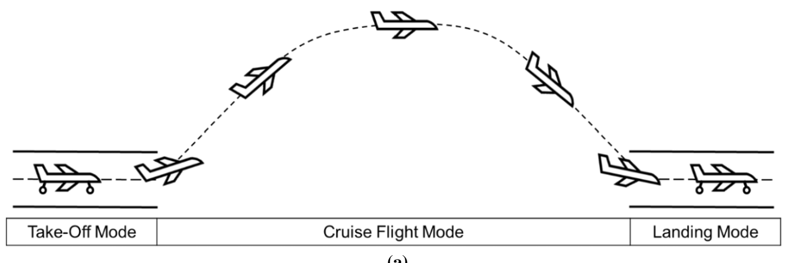
 * **_Rotary-Wing_ (VTOL).** _Rotary-Wing_ UAV, UAV yang membentuk gaya angkat melawan gravitasi dengan memutar angin. UAV jenis ini memiliki keunggulan untuk lepas landas dan mendarat secara vektikal. Fitur ini memungkinkan operasi penerbangan dalam area yang lebih sempit. Selain itu, VTOL juga dapat melakukan "pelayangan" di udara yang memungkinkan UAV jenis ini untuk mempertahankan ketinggian di udara. Kekurangan VTOL atau _Rotary-Wing_ UAV adalah penggunaan bahan bakar yang tinggi karena seluruh rotor harus bergerak terus-menerus untuk membentuk gaya angkat yang kontinu [(Lee, Kim, & Chu, 2021)](https://doi.org/10.1007/s12541-021-00489-y). 
 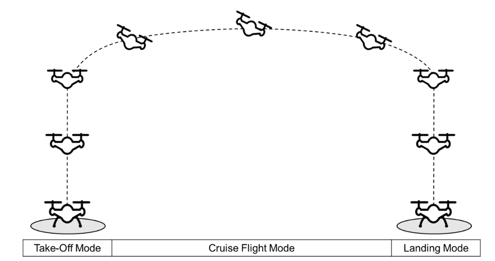
 * **_Hybrid-Wing Based UAV_.** UAV jenis ini membentuk gaya angkat dengan mengombinasikan _fixed wing_ dan _rotating wing_. _Hybrid-wing_ mengombinasikan keunggulan dua jenis penerbangan. Contohnya, UAV jenis ini dapat melakukan lepas landas dan mendarat secara vertikal (VTOL) dan mempertahankan ketinggian di udara dengan rotor sekaligus terbang dengan kecepatan tinggi dan menempuh perjalanan jarak jauh dengan membentuk gaya angkat dengan _fixed wing_ [(Lee, Kim, & Chu, 2021)](https://doi.org/10.1007/s12541-021-00489-y).
 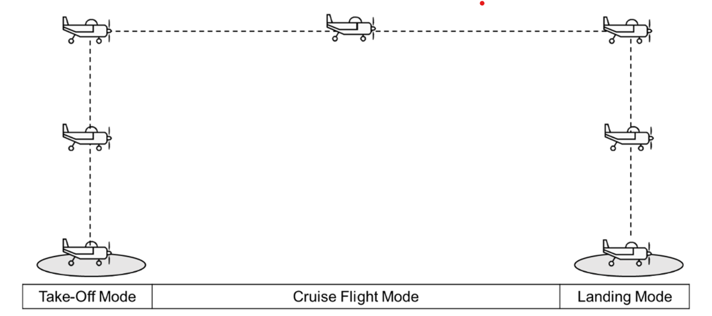

b. Menurut [Desa (2014)](https://www.academia.edu/21293217/Yaw_Pitch_and_Roll_controller_design_for_fixed_wing_UAV_under_uncertainty_and_perturbed_condition), _pitch angle_ ($\theta$) adalah sumbu yang melewati pesawat dari ujung sayap sampai ujung sayap lainnya. Pergerakan yang memanjang di sekitar sumbu tersebut disebut _pitch_. _Pitch angle_ digunakan untuk mengubah arah vertikal UAV _fixed-wing_ yang dapat dikontrol dengan pergerakan elevator (dalam kata lain, apakah kerucut hidung pesawat sedang menghadap ke atas atau bawah). Sementara itu, _roll angle_ adalah sumbu yang melewati pesawat dari ujung kerucut hidung pesawat hingga ekor pesawat. Pergerakan yang melintang sepanjang sumbu tersebut disebut dengan pergerakan _roll_. Gerakan memutar tersebut disebabkan oleh pembelokan aileron pesawat. Terakhir, _yaw angle_ adalah sumbu yang menembus ruang antara pesawat dari atas sampai bawah. Pergerakan memutar dengan sumbu rotasi sumbu tersebut disebut _yaw_.

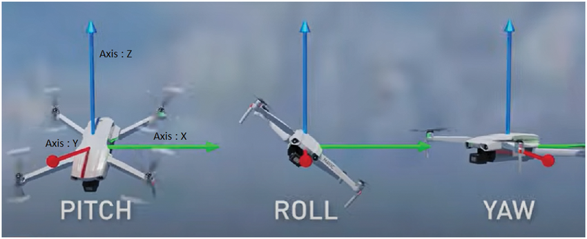  
Sumber gambar: https://www.researchgate.net/publication/357930432_Deep_Reinforcement_Learning_Based_Unmanned_Aerial_Vehicle_UAV_Control_Using_3D_Hand_Gestures

Menurut [NASA (2021)](https://www.grc.nasa.gov/www/k-12/airplane/move.html), _ground speed_ 'kecepatan di tanah' adalah kecepatan relatif suatu kendaraan terbang dengan sudut pandang referensi dari tanah. Sementara itu, _airspeed_ 'kecepatan di udara' merupakan kecepatan relatif suatu kendaraan terbang dengan sudut pandang referensi dari tanah. _Airspeed_ tidak dapat dihitung dari posisi tanah, tetapi harus dengan _ground speed_ dan _wind speed_ 'kecepatan angin'. _Airspeed_ adalah selisih antara vektor _ground speed_ dan _wind speed_.

_Airspeed_ = _Ground speed_ - _Windspeed_

Dalam keadaan ideal ketika angin tidak bertiup (_windspeed_ = 0), besar _airspeed_ dan _ground speed_ sama. Apabila angin bertiup searah dengan arah gerak kendaraan terbang (seperti UAV), besar _airspeed_ akan lebih kecil daripada _ground speed_.

Menurut [Lerus Training (2024)](https://www.lerus.com/articles/hdop-horizontal-dilution-of-precision-in-gps-and-dgps-systems.html), HDOP adalah indikator utama pengukuran keberhasilan yang digunakan untuk menilai akurasi sistem GPS atau DGPS. HDOP akan merefleksikan dampak geometris satelit terhadap akurasi posisi horizontal GPS _receiver_. Makin kecil HDOP, makin baik pula akurasinya. HDOP yang rendah terjadi ketika satelit terdistribusi dengan rata di langit sehingga kekuatan triangulasi (pengukuran) lebih kuat, sementara HDOP yang tinggi terjadi ketika satelit berkumpul di satu area sehingga akurasi posisi menjadi lebih lemah. HDOP 1-2 menunjukkan akurasi yang sangat baik sehingga cocok untuk operasi kritis, 2-5 menunjukkan akurasi yang cukup baik sehingga cukup untuk kebanyakan tugas di sekitar pantai, angka di atas 5 menunjukkan akurasi yang buruk sehingga membutuhkan sistem alternatif. Akurasi GPS akan berguna untuk menentukan apakah tempat tersebut cukup layak untuk menerbangkan UAV atau tidak.

Sementara itu, berdasarkan jurnal dari [Khan et al. (2021)](https://scispace.com/pdf/rssi-controlled-long-range-communication-in-secured-iot-2kn3bqmmzw.pdf), RSSI (_Received Signal Strength Identifier_) atau biasa juga dikenal sebagai pengukuran kekuatan sinyal yang diterima adalah teknik untuk mengalkulasi jarak antara dua UAV atau _node_ nirkabel. Kekuatan sinyal akan bervariasi bergantung pada perubahan jarak _node_. RSSI dapat digunakan untuk proses lokalisasi (menghitung jarak antar-_node_).

c. Menurut [Studiawan dan Choo (2025)](https://doi.org/10.1007/978-3-031-93511-4_2), komponen-komponen UAV adalah sebagai berikut.

 * **Kerangka Pesawat (_Airframe_)** yang didesain untuk mendukung komponen lainnya adalah rangka struktural sebuah UAV. Beratnya harus ringan, tetapi kuat menahan tekanan ketika penerbangan berlangsung. Umumnya, kerangka pesawat dibuat dengan aluminium, serat karbon, dan material-material campuran. Pertimbangan desain UAV adalah efisiensi aerodinamika dan ketahanan. Contohnya, campuran serat karbon sering digunakan karena kuat dan ringan sekaligus serta dapat menahan faktor lingkungan.

 * **Sistem Propulsi** mencakup motor, baling-baling, dan baterai; UAV dapat terbang dengan daya tolak yang dibentuk oleh komponen-komponen ini. Tipe dan konfigurasinya akan bergantung kepada desain dan tujuan dibuatnya UAV. Riset menyatakan bahwa apabila desain-desain komponen ini optimal, performa dan ketahanan uji UAV akan meningkat.

 * **Sistem Kontrol** adalah "otak" dari sebuah UAV; meliputi pengontrol penerbangan, modul GPS, dan sensor-sensor lainnya. Sistem kontrol memastikan UAV tetap stabil, menavigasi dengan akurat, dan merespons kepada perintah dari operator atau algoritma kontrol otonom. Pengontrol penerbangan yang _open-source_ sangat penting untuk kontrol otonom dan navigasi sehingga perangkat keras dan lunak dapat terintegrasi untuk mengatur dinamika penerbangan UAV.

 * **_Payload_** merupakan perlengkapan UAV--kamera, sensor, dan instrumen lainnya--untuk tugas-tugas spesifik. _Payload_ akan bervariasi tergantung aplikasi UAV: dari fotografi udara hingga memonitor lingkungan. UAV modern mengintegrasikan sensor-sensor yang bermacam-macam seperti kamera, LiDAR (_light detection and ranging_ atau alat yang digunakan untuk menghitung jarak/rentang ke muka bumi menggunakan pacaran cahaya [[National Ocean Service, 2024](https://oceanservice.noaa.gov/facts/lidar.html)]), dan sensor inframerah untuk menghimpun data dan menjalankan misi-misi tertentu.

 * **Sistem Komunikasi** memungkinkan transmisi dan resepsi data antara UAV dan GCS (_Ground Control System_). Sistem komunikasi terbentuk atas jaringan radio, komunikasi satelit, dan jaringan seluler. Penting untuk memastikan kemananan berkomunikasi ketika operasi UAV dijalankan.

 * **Sumber Daya (_Power Source_)** yang digunakan UAV biasanya berasal dari baterai, tetapi dapat juga menggunakan sumber daya alternatif seperti sel bahan bakar (_fuel cell_) atau panel surya tergantung desain dan syarat menjalankan misi UAV. Pengembangan baterai dapat meningkatkan waktu penerbangan dan jangkauan (jarak) operasional UAV.

 * **Sistem Navigasi** mencakup GPS, IMU (_inertial measurement units_ 'unit pengukuran inersia/kelembaman'), dan beberapa hal terkait navigasi lainnya yang memungkinkan UAV menentukan posisi dan orientasi di langit lepas. Dengan sensor _consumer-grade_ 'yang dikhususkan untuk konsumer' yang ringan, UAV dapat mencapai data geografis yang akurat; penting untuk aplikasi seperti pemetaan dan survei.

Hubungan antarkomponen menggunakan diagram blok adalah sebagai berikut.
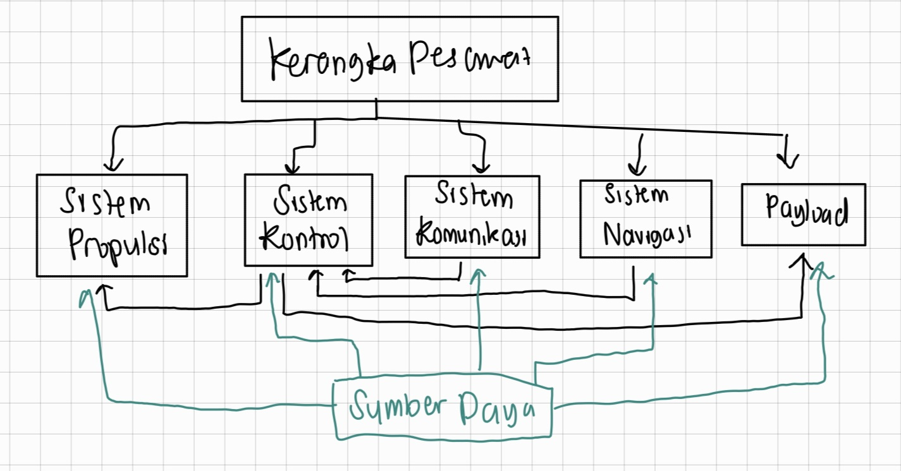

Dalam diagram tersebut, kerangka pesawat bertugas menopang komponen-komponen lain. Sementara itu, sistem propulsi menerbangkan UAV dan mengerjakan seluruh tugas fisik (lepas landas, terbang, mendarat) yang diperintahkan oleh sistem kontrol. Sistem kontrol mendapat perintah melalui sistem komunikasi yang memungkinkan pengguna/pilot "berkomunikasi" dengan UAV. Selain sistem komunikasi, sistem kontrol juga mendapat data-data dari sistem navigasi yang dapat dibaca dan diproses sesuai kebutuhan. _Payload_ yang digunakan untuk tugas khusus mendapat akan mendapat tugas dari sistem kontrol untuk dijalankan agar tujuan penerbangan tercapai. Terakhir, sumber daya berfungsi untuk memberi daya kepada semua komponen (kecuali kerangka pesawat karena fungsinya hanya menopang) agar dapat menjalankan tugasnya dengan baik.

d. Publikasi ilmiah: [Unmanned Aerial Vehicles (UAV) in Precision Agriculture: Applications and Challenges](https://doi.org/10.3390/en15010217)

  i. Perkenalan  
    UAV telah digunakan oleh banyak negara maju untuk agrikultur presisi karena dapat membantu membuat panen berkualitas baik, mengurangi infeksi, serta  menyebarkan pupuk dan pestisida. UAV berketinggian rendah memiliki banyak keuntungan seperti mobilitas baik, konstruksi yang mudah, serta resolusi gambar yang tinggi. Di masa depan, agrikultur presisi akan bergantung pada sensor, robot, IoT, pemelajaran mesin, dan sistem pendukung yang _decision-based_.

  ii. Agrikultur Presisi  
    Agrikultur presisi membantu petani membuat keputusan dengan data. RS (_Remote Sensing_) memiliki peran penting untuk menilai hasil panen dan kondisi tanah. UAV adalah jenis RS yang paling fleksibel dan menyelesaikan masalah dibanding jenis lainnya. Selain itu, UAV mudah diakses, akurat, murah, dan dapat mengoperasikan gambar _real-time_.

  iii. Jenis UAV
   * _fixed-wing_: Biasanya dilengkapi kamera resolusi tinggi untuk pemetaan dan survei dari ketinggian. Arsitektur dan pemeliharaan cenderung mudah.
   * _single rotor_:  Terdiri atas helikopter dan sistem yang mengaturnya dari tanah. Memiliki banyak kontrol variabel yang dapat dihitung menggunakan filter Kalman dan PID (_Proportional-Integral-Derivative_)
   * _hybrid VTOL_: Memiliki manfaat _fixed-wing_ (ketahanan terbang) dan multirotor (pendaratan). Pemeliharaan kompleks.
   * _multi rotor_  
    1. _tricopter_: Tiga rotor. Satu rotor berputar searah jarum jam, dua lainnya berlawanan sehingga trikopter dapat maju dan menyamping.  
    2. _quadcopter_: Empat rotor. Desain superior; dua rotor berputar searah jarum jam, dua lainnya berlawanan. Lebih stabil.  
    3. _hex copter_: Enam rotor. Biasanya digunakan untuk menyebarkan pestisida dengan kapasitas fluida 5 liter. Peralatan mendarat berada di bawah unit penyemprotan sehingga aman untuk lepas landas dan mendarat. Memiliki 4 penyemprot.  
    4. _octocopter_: Delapan rotor. Fungsi mirip dengan _hex copter_. Memiliki 6 penyemprot. Kelajuan rotor dan posisi penyemprot memengaruhi pergerakan semburan. 
  
  iv. Peran UAV dalam Agrikultur Presisi  
    Untuk memonitor tanaman yang terinfeksi, menyemprotkan pestisida, dan memberi pupuk dengan kecepatan baik dan sistem akurat. Bagian-bagian penyemprot UAV:  
     1. Bagian ujung penyemprot  
     2. Pengontrol penyemprot  
     3. Kotak pestisida  
     4. Sensor pengukur aliran  
     5. Pompa diafragma kecil  
     6. Sistem interpretasi peta 

  Penyemprot berbasis UAV lebih efisien dibanding sistem tradisional karena mengurangi bahaya, waktu, dan biaya. Pengembangan UAV terbaru meningkatkan pemroses gambar yang cepat; meningkatkan efisiensi untuk deteksi hama. _Remote sensing_ juga dapat digunakan untuk melihat persebaran tanaman dan lahan kosong di area tertentu. Selain itu, terdapat kombinasi antara _remote sensing_ dan _machine learning_ untuk pemeriksaan lanjutan dalam lahan yang lebih luas.

  Terdapat sistem model hibrida yang mengombinasikan sistem klasifikasi terlatih dan model deteksi objek (RetinaNet) yang berhasil mengklasifikasikan tanaman sehat atau terinfeksi dengan akurasi 99,4%. Terdapat pula pendekatan yang mengintegrasikan parameter lingkungan dan pertumbuhan tanaman dengan efek klasifikasi performa gambar yang menghilangkan tanaman terinfeksi dengan gambar dari satelit Landsat-8. Model ini memiliki akurasi 82,6%. Lebih jauh lagi, teknologi RS dapat digunakan untuk tanaman yang stres dan defisiensi nutrisi. Dengan demikian, teknologi RS memiliki banyak aplikasi dalam bidang agrikultur dengan akurasi presisi yang cukup tinggi.
  
  v. Manfaat Ekonomis Teknologi UAV
   * Menambah produktivitas petani secara global
   * Mengurangi tanaman yang rusak dan meningkatkan hasil panen
   * Meningkatkan ekspor dan mengurangi impor di negara berkembang sehingga tercipta keseimbangan
   * Mengurangi kemiskinan dan meningkatkan kualitas hidup

#### 6. Algoritma
a. Berdasarkan [Red Blob Games (2014)](https://www.redblobgames.com/pathfinding/a-star/introduction.html), A* merrupakan salah satu algoritma _pathfinding_ 'pencari jalan' yang menemukan jalan yang terbentuk oleh grafik _node_ dan _edge_ untuk menuju suatu destinasi. Perbedaan algoritma A* dari algoritma pendahulu seperti Breadth First Search dan Djikstra adalah pengombinasian antara jarak sebenarnya dengan jarak yang diperkirakan; kombinasi antara Greedy Best First Search dan Djikstra. Dalam Breadth First Search _pathfinding_, seluruh jarak antar-_nodes_ dicari dan disimpan, kemudian jalan yang telah dilalui dapat direkonstruksi sehingga ditemukan jalan terpendek. Dalam Djikstra, jarak antar-_nodes_ hanya akan disimpan apabila jalan tersebut lebih baik daripada jalan terbaik sebelumnya sehingga terbentuk "antrean prioritas". Dengan demikian, ditemukan jalan terpendek dengan mempertimbangkan "berapa pergerakan yang dibutuhkan untuk mencapai jalan" ketika proses pencarian. Terdapat pula Greedy Best First Search yang menggunakan perkiraan "jalan mana yang sekiranya paling dekat dengan tujuan". Perkiraan tersebut tidak selalu akurat, terutama apabila ada penghalang seperti dinding. A* mengombinasikan keduanya dengan menghitung jarak terbaik sebelumnya ditambah dengan jarak yang sekiranya terdekat. Dengan demikian, tercipta proses pencarian jalan yang lebih efisien. A* digunakan untuk menemukan jalan menuju satu lokasi tertentu, berbeda dengan Breadth First Search dan Djikstra yang lebih baik dalam penemuan jalan untuk pergi ke semua lokasi.

Sementara itu, menurut [Stentz (1994)](https://web.mit.edu/16.412j/www/html/papers/original_dstar_icra94.pdf), nama algoritma D* dipilih karena mirip dengan A*, tetapi D* cenderung dinamis; _arc cost parameters_ (hambatan) dapat berubah selama proses penyelesaian masalah. Apabila pergerakan robot terhubung dengan benar dengan algoritma, D* menghasilkan lintasan yang optimal. Tujuan _path planner_ adalah mencapai lokasi yang dituju dengan menghindari alangan serta meminimalisasi "pengeluaran" metrik (misalnya panjang lajur). D* menggunakan _backpointer_ untuk merepresentasikan lajur-lajur yang memungkinkan untuk mencapai tujuan. D* membuat _list_ OPEN yang digunakan untuk menyebarkan informasi terkait perubahan hambatan lajur dan menghitung hambatan setiap lajur di tahap tertentu. Setiap kemungkinan lajur akan disebut NEW jika belum pernah ditaruh di _list_ OPEN, OPEN jika berada di _list_ OPEN, dan CLOSED jika sudah tidak berada di _list_ OPEN. Setiap kali terdapat perubahan, D* mendeteksinya dan membagi setiap anggotanya menjadi dua tipe: RAISE dan LOWER. RAISE untuk anggota yang mengalami kenaikan "pengeluaran", serta LOWER untuk anggota yang mengalami penurunan "pengeluaran". Ini memungkinkan D* untuk terus memperbarui anggota dalam _list_ OPEN. Setelah diperbarui, perubahan tersebut akan dilanjutkan (untuk diperiksa) ke lajur terdekat dan seterusnya.

Dengan demikian, D* cocok digunakan untuk _path planning_ bagi lajur dinamis, dalam artian keadaan lajur kerap kali berganti.

Berikut ini contoh penggunaan algoritma D*
* Mengoptimalisasi navigasi swatantra UAV [(Suanpang & Jamjuntr, 2024)](https://doi.org/10.3390/su16177867) 
* Mengoptimalisasi pemilihan lajur UAV dalam lingkungan yang berbeda-beda [(Wang, Wang, & Yang, 2024)](https://doi.org/10.1117/12.3027181)
* _Path planning_ robot dengan dua sambungan lengan dalam lingkungan dinamis [(Raheem & Hameed, 2019)](https://doi.org/10.22153/kej.2019.01.004)

b. Menurut [Chen (2024)](https://doi.org/10.54097/6q4xxg69), PID (_proportional-integral-derivatives_) adalah mekanisme kontrol timbal balik yang didasarkan pada tiga komponen esensial tersebut (proporsional, integral, derivatif). Teknik kontrol ini esensial untuk menyelesaikan permasalahan dinamis dalam konteks sistem _engineering_ karena simplisitas, fleksibilitas, dan efektivitasnya. Kontrol PID merupakan teknik automasi industrial yang lumrah digunakan dalam proses manufaktur, produksi, dan aplikasi industri lainnya. Teknik kontrol PID paling sesuai digunakan ketika terdapat kekurangan pemahaman komprehensif tentang sistem dan objek yang akan digunakan atau ketika parameterisasi akurat tidak dapat diperolah dengan cara yang sistematis. Pengontrol PID merupakan pengontrol bertipe linear yang menghasilkan keluaran pengontrol berupa penyimpangan antara himpunan nilai dan hasil praktis. Hal yang membentuk sistem kontrol PID adalah kombinasi linear antara komponen proporsional, integral, dan derivatif. Representasi matematis pengontrol PID adalah sebagai berikut.

$$
  u_{(t)} = K_p \times e_{(t)} + K_i \times \int_{0}^{t} e_{(t)} dt + K_d \times \frac{de_{(t)}}{dt}
$$

dengan $u(t)$ sebagai keluaran pengontrol, $e(t)$ sebagai kesalahan saat ini, dan $K_p$, $K_i$, dan $K_d$ secara berurutan adalah setelan parameter proporsional, integral, dan derivatif. 

Aplikasi kontrol PID dalam berbagai bidang adalah sebagai berikut.
* Industri manufaktur: Aplikasi dalam suhu, aliran, tekanan, kelajuan, tingkat cairan, kualitas, pencampuran gas, dan posisi mekanikal.
* Industri kimia: Secara tepat meregulasi suhu, tekanan, dan aliran. Optimisasi ini dapat meningkatkan efisiensi reaksi, meningkatkan kualitas produk, serta menjaga sistem tetap stabil dan berfungsi.
* Sistem listrik: Menjaga stabilitas keluaran voltase, meregulasi frekuensi untuk menjaga frekuensi sistem tetap berada dalam rentang yang benar, meningkatkan efisiensi sistem, serta menjaga stabilitas sistem dalam berbagai variasi beban [(Chen, 2024)](https://doi.org/10.54097/6q4xxg69).

c. Berdasarkan tulisan [Welch dan Bishop (2002)](https://www.mit.edu/course/16/16.070/www/project/PF_kalman_intro.pdf), Filter Kalman adalah himpunan persamaan matematika yang menyediakan solusi komputasional (rekursif) yang efisien dari metode kuadrat terkecil. Filter ini sangat berguna dalam beberapa aspek karena dapat memperkirakan keadaan pada masa lalu, kini, dan masa depan. Bahkan, filter Kaman dapat digunakan ketika aspek alamiah sebuah sistem tidak diketahui secara pasti.

Filter ini menyampaikan masalah umum dengan cara mencoba mengukur keadaan $x \in \mathbb{R}^n$ dalam sebuah _discrete-time controlled system_ yang mengacu pada LSDE (_linear stochastic difference equation_).

$$
x_k = Ax_{k-1} + Bu_k + w_{k-1}
$$

dengan pengukuran $z \in \mathbb{R}^m$, yakni
$$
z_k = Hx_k + v_k
$$

Variabel $w_k$ merepresentasikan proses gangguan dan $v_k$ menunjukkan pengukuran gangguan. Keduanya diasumsikan saling independen, murni, dan dengan distribusi probabilitas yang normal.

$$
p(w) ~ N(0,Q)
$$
$$
p(v) ~ N(0,R)
$$

Praktisnya, matriks Q (kovarian proses gangguan) dan R (kovarian pengukuran gangguan) dapat berubah sepanjang proses perhitungan, tetapi dalam hal ini, keduanya diasumsikan konstan.

Secara umum, Kalman filter mengestimasi sebuah keadaan proses dalam waktu tertentu dan memperoleh timbal balik dalam bentuk pengukuran yang _noisy_ 'tidak keruan'. Dengan demikian, persamaan-persamaan filter Kalman terbagi menjadi dua kelompok: persamaan "pembaruan waktu" dan persamaan "pembaruan pengukuran". Persamaan pembaruan waktu disebut dengan persamaan _predictor_, sementara persamaan pembaruan pengukuran disebut dengan persamaan _corrector_. Siklus filter Karman adalah sebagai berikut.

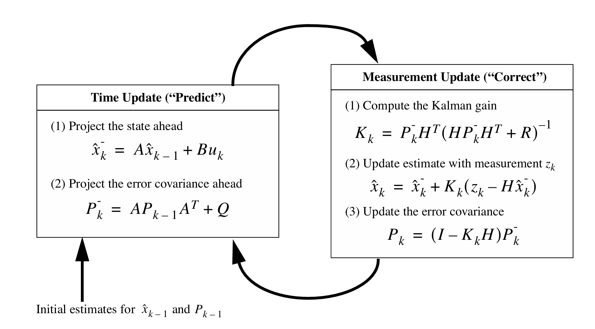

Penggunaan filter Kalman adalah dalam bidang robotik, kecerdasan buatan, serta sistem kontrol [(Ramachandran, 2024)](https://www.researchgate.net/publication/384762080_Kalman_Filters_and_Beyond_A_Comprehensive_Review_of_State_Estimation_Techniques_in_Robotics_Artificial_Intelligence_and_Complex_Dynamic_Systems)

Sementara itu, perpanjangan filter Kalman (_extended Kalman filter_) digunakan ketika proses dan/atau hubungan pengukuran dengan proses tidak linear. Mean terkini dan kovarian dapat dilinearisasi dengan filter ini. Dengan menggunakan deret Taylor, linearisasi dapat diperoleh dengan turunan parsial dari fungsi proses dan pengukuran. Jadi, secara umum, perpanjangan filter Kalman memiliki prosedur yang mirip dengan filter Kalman, tetapi ditambah dengan proses linearisasi di awal.

Perpanjangan filter Kalman juga memiliki siklus yang meliputi persamaan pembaruan waktu dan persamaan pembaruan pengukuran. Berikut adalah siklus perpanjangan filter Karman.

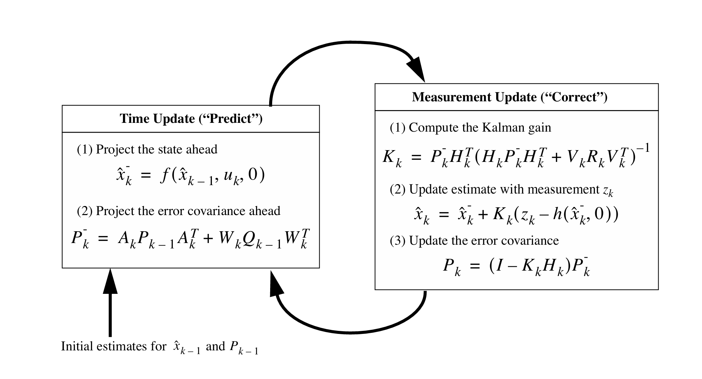

###
---

### Referensi
* [Git Documentation](https://git-scm.com/docs/git#_git_commands)
* [Ardupilot Documentation](https://ardupilot.org/planner/docs/mission-planner-features.html)
* [Comparative Analysis of Fixed-Wing, Rotary-Wing and Hybrid Mini Unmanned Aircraft Systems (UAS) from the Applications Perspective](https://doi.org/10.13111/2066-8201.2022.14.1.12)
* [A Survey: Flight Mechanism and Mechanical Structure of the UAV](https://doi.org/10.1007/s12541-021-00489-y)
* [Yaw, Pitch and Roll controller design for fixed-wing UAV under uncertainty and perturbed condition](https://www.academia.edu/21293217/Yaw_Pitch_and_Roll_controller_design_for_fixed_wing_UAV_under_uncertainty_and_perturbed_condition)
* [Deep Reinforcement Learning Based Unmanned Aerial Vehicle (UAV) Control Using 3D Hand Gestures](https://www.researchgate.net/publication/357930432_Deep_Reinforcement_Learning_Based_Unmanned_Aerial_Vehicle_UAV_Control_Using_3D_Hand_Gestures)
* [Relative Velocities - Ground Reference](https://www.grc.nasa.gov/www/k-12/airplane/move.html)
* [HDOP: Horizontal Dilution of Precision in GPS and DGPS Systems](https://www.lerus.com/articles/hdop-horizontal-dilution-of-precision-in-gps-and-dgps-systems.html)
* [RSSI-Controlled Long-Range Communication in Secured
IoT-Enabled Unmanned Aerial Vehicles](https://scispace.com/pdf/rssi-controlled-long-range-communication-in-secured-iot-2kn3bqmmzw.pdf)
* [UAV Components and Ecosystem](https://doi.org/10.1007/978-3-031-93511-4_2)
* [What is lidar?](https://oceanservice.noaa.gov/facts/lidar.html)
* [Unmanned Aerial Vehicles (UAV) in Precision Agriculture: Applications and Challenge](https://doi.org/10.3390/en15010217)
* [Introduction to the A* Algorithm](https://www.redblobgames.com/pathfinding/a-star/introduction.html)
* [Optimal and Efficient Path Planning for Partially-Known Environments](https://web.mit.edu/16.412j/www/html/papers/original_dstar_icra94.pdf)
* [Optimizing Autonomous UAV Navigation with D* Algorithm for Sustainable Development](https://doi.org/10.3390/su16177867)
* [Using D* algorithm to optimize the path selection of UAV in different environments](https://doi.org/10.1117/12.3027181)
* [Heuristic D* Algorithm Based on Particle Swarm Optimization for Path Planning of Two-Link Robot Arm in Dynamic Environment](https://doi.org/10.22153/kej.2019.01.004)
* [A Comprehensive Analysis of PID Control Applications in Automation Systems: Current Trends and Future Directions](https://doi.org/10.54097/6q4xxg69)
* [An Introduction to the Kalman Filter](https://www.mit.edu/course/16/16.070/www/project/PF_kalman_intro.pdf)